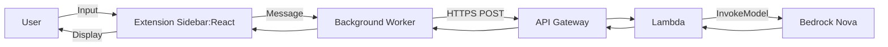

# PRD v1 - Minimal Browser Extension (Stateless)

## Summary

A minimal Chrome extension that lets a user submit text (page content or manual input) and receive a processed response from an AWS Bedrock Nova model. The system is stateless: no S3, no DynamoDB, no vector store.

## Goals

- Provide a simple UI in a right-side browser sidebar.
- Accept user input (notes or page content).
- Send input to a backend endpoint.
- Use AWS Bedrock Nova for processing.
- Return results to the UI quickly.

## Non-Goals (v1)

- Long-term storage or user accounts.
- Retrieval-augmented generation or vector search.
- Multi-browser support beyond Chrome.
- Fine-grained analytics or A/B testing.

## Primary User Flow

1. User opens the extension sidebar.
2. User pastes input or captures current page content.
3. User selects a quick action (e.g., summarize, extract key info).
4. Extension sends request to backend.
5. Backend calls Bedrock Nova and returns response.
6. Sidebar displays the result.

## Functional Requirements

- UI must render a right-side sidebar with action controls.
- User can paste input and optionally capture page text.
- Must support at least two actions:
  - Summarize
  - Extract key information
- Must support synchronous response display (single request/response).
- Results must be returned in Markdown format and rendered in the sidebar.

## Non-Functional Requirements

- Response time target: < 5 seconds for typical inputs.
- Stateless backend; no data persistence.
- Secure API with basic auth or API key.
- Minimal operational footprint.
- Use shadcn/ui for consistent styling and rapid development.

## Architecture

### Components

- **Chrome Extension (React Sidebar)**
  - UI for input, action selection, output display.
  - Sends requests to backend.
- **Background/Service Worker**
  - Handles API calls and auth token storage.
- **Backend (AWS Serverless)**
  - API Gateway (REST)
  - Lambda (Node/TS)
  - AWS Bedrock Nova model

### Data Flow

1. Sidebar captures user input.
2. Background worker sends POST request to API Gateway.
3. Lambda validates input, calls Bedrock Nova.
4. Lambda returns model output.
5. Sidebar renders output.

## Architectural Diagram (Mermaid)

Note: To render Mermaid in local Markdown preview (e.g., VS Code), install a Mermaid preview extension. GitHub renders Mermaid automatically.



## API Contract

### POST /process

Request:

```json
{
  "action": "summarize" | "extract",
  "text": "..."
}
```

Response:

```json
{
  "result": "...",
  "format": "markdown",
  "model": "nova",
  "latency_ms": 1234
}
```

## Security

- Use API Gateway API key or JWT for auth (v1 can start with API key).
- CORS restricted to extension origin.
- Input validation in Lambda (size limits and type checks).

## Deployment

- Deploy Lambda via SAM or CDK.
- API Gateway REST endpoint.
- Bedrock access configured via IAM role.

## Open Questions

- Max input size for v1?
- Should we support streaming responses later?
- Should actions be configurable in UI?
