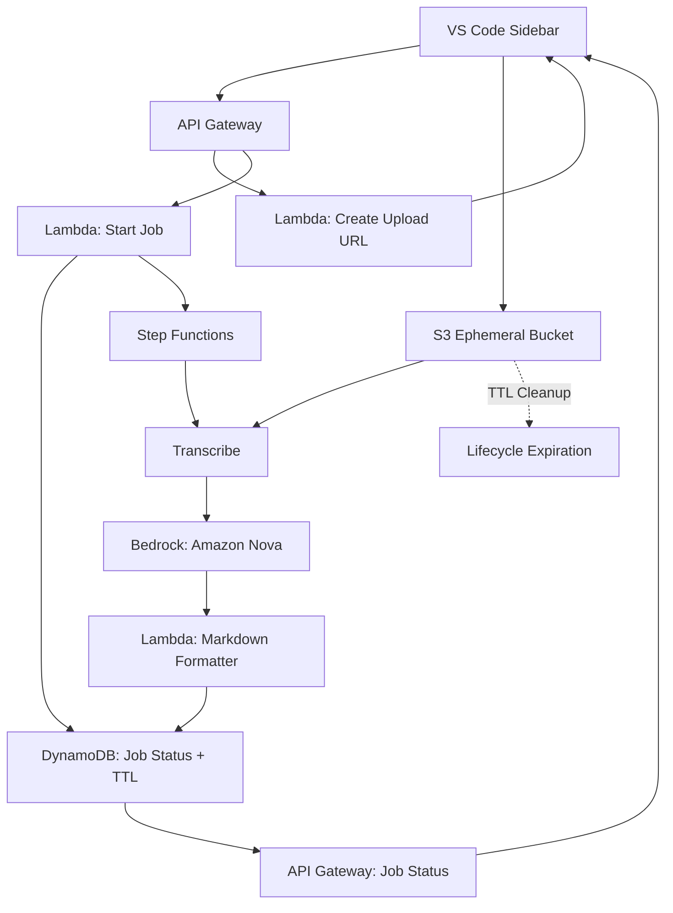

# PRD — AWS Serverless Workflow (Async) — 2026-02-12

## Overview
Implement an async, serverless pipeline that accepts audio + notes, transcribes, summarizes using Amazon Bedrock (Amazon Nova model, free tier where possible), and returns structured Markdown output. Temporary data storage is allowed but must be short-lived and encrypted.

## Scope And Repo Structure
- All frontend code lives under `frontend/`.
- All backend code lives under `backend/`.
- Backend is provisioned using AWS CDK (TypeScript).

## Goals
- Async job-based processing with status polling.
- Use Bedrock (Amazon Nova) for summarization.
- Enforce minimal data retention via TTL and cleanup.
- Return Markdown matching the template in `readme/transcribed_notes.md`.

## Non-Goals
- Long-term storage of audio or transcripts.
- Real-time streaming transcription.

## AWS Services
- API Gateway (HTTP API preferred)
- AWS Lambda (job start, status read, callbacks)
- AWS Step Functions (orchestration)
- Amazon Transcribe (speech-to-text)
- Amazon Bedrock (Amazon Nova model)
- Amazon S3 (ephemeral storage)
- Amazon DynamoDB (job status + TTL)
- AWS KMS (encryption)
- CloudWatch (logs, metrics, alarms)
- IAM (least privilege)

## Architecture
### Data Handling
- Audio uploaded to an S3 bucket with strict lifecycle expiration (15–60 minutes).
- Transcripts and intermediate artifacts stored in memory where possible. If stored, use short TTL.
- DynamoDB stores job status and result Markdown with TTL.

### Async Flow
1. Client submits audio + notes to API Gateway.
2. Client requests a pre-signed S3 upload URL from API Gateway.
3. Client uploads audio directly to S3.
4. Lambda validates input, creates job in DynamoDB, starts Step Functions execution.
3. Step Functions runs:
   - Transcribe job (S3 input).
   - Summarization via Bedrock (Amazon Nova) with notes context.
   - Format into Markdown template.
   - Store result Markdown in DynamoDB, mark job `SUCCEEDED`.
5. Client polls `GET /v1/summary/jobs/{jobId}` for status.
6. On completion, return Markdown to client.
7. Cleanup: delete S3 object immediately after successful transcription or at TTL expiration.

## Mermaid Diagram

## API Contract (Backend)
- `POST /v1/summary/jobs`
  - Input: `s3Key`, `notes`, optional `metadata`
  - Response: `{ jobId, status }`
- `GET /v1/summary/jobs/{jobId}`
  - Response: `{ jobId, status, progress, resultMarkdown? }`
- `POST /v1/summary/uploads`
  - Input: `filename`, `contentType`, `size`
  - Response: `{ uploadUrl, s3Key }`

## Output Contract
Must match the structure in `readme/transcribed_notes.md`.

## Best Practices
- Encryption at rest (S3 SSE-KMS, DynamoDB KMS).
- Encryption in transit (TLS 1.2+).
- IAM least privilege with scoped roles for Lambda, Step Functions, Transcribe, Bedrock.
- Short-lived S3 bucket with lifecycle policy + explicit deletion after job completion.
- DynamoDB TTL to remove job data after a short retention period (24 hours).
- CloudWatch alarms for error rates and latency.
- Request validation + size limits in API Gateway.
- Use pre-signed S3 upload URLs to avoid API Gateway payload limits.
- Use Bedrock Amazon Nova models with cost controls and token limits.
- Idempotent job start to avoid duplicate processing on retries.

## Error Handling
- Validation failures: return 400.
- Transcribe failure: retry with exponential backoff and fail job.
- Bedrock failure: retry and fail with error reason.
- Timeouts: mark job `FAILED` with message.

## Constraints
- Max audio size: 200MB.
- Max audio duration: 2 hours.
- Max job duration: 10 minutes end-to-end.
- S3 TTL: 15–60 minutes (target 30 minutes).
- DynamoDB TTL: 24 hours.

## CDK Implementation Notes
- CDK app in `backend/infra` with stacks for API, storage, and workflows.
- Lambda code in `backend/lambdas`.
- Step Functions definitions in `backend/workflows`.
- Environment config via SSM Parameter Store.

## Assumptions
- Bedrock Nova model is enabled in the selected region.
- API Gateway CORS allows the extension origin.
